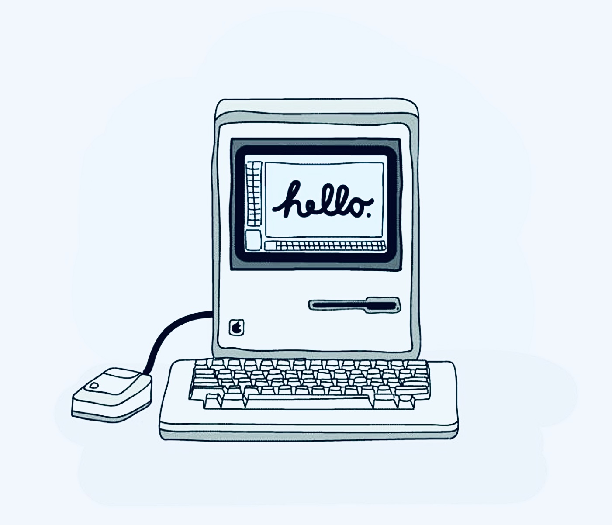

  

# MacDraw Enhanced

A classic-Mac-inspired drawing app that combines pixel painting with editable SVG vector paths.

## Open the app

Visit https://wonka15.github.io/Mac-Paint-Draw-Enhanced-/

## Beginner-friendly project structure

- `index.html` — the page structure: buttons, panels, canvas, and labels.
- `styles.css` — the visual design and layout.
- `app.js` — drawing tools, vector paths, saving, undo/redo, and exports.

Keep these jobs separate: HTML describes the interface, CSS styles it, and JavaScript makes it work. Most tool behavior lives in `app.js`.

## Vector pen, Bézier curves, and anchor points

- Choose **Vector Pen** and click to create straight-line anchor points.
- Choose **Bézier Curve** and click-drag at each anchor to shape its curve handles. Drag direction controls the outgoing curve; the opposite handle is mirrored for a smooth join.
- Click the first anchor (three or more points) to close a path, or press **Enter** / double-click to finish an open path.
- Choose **Edit Points** and drag an anchor to reposition it.
- Choose **Export SVG · Vinyl** to save vector paths, including curves, as black, unfilled SVG outlines.

The SVG export contains vector paths only. Freehand pencil marks on the raster canvas are not included. SVG is commonly accepted by vinyl-cutting software, but confirm your cutter software's import settings and perform a small test cut first.

## How AI could fit in

GitHub Pages serves static files, so it cannot safely keep a private AI API key. A real AI feature—such as “make a simple cat silhouette” or “clean up this outline”—should call a small server-side endpoint that stores the key securely. Never put a secret API key in `app.js` or any public GitHub file.

## Planned upgrades

- Smooth Bézier curve handles.
- Select, move, scale, and duplicate whole vector objects.
- SVG import and bitmap tracing.
- Optional AI-assisted outline creation through a secure backend.

## Zoom, rulers, guides, and Pathfinder

- Use **− / +** to zoom and **Fit** to fit the canvas to the available workspace.
- Drag from the top ruler down onto the canvas to place a horizontal guide. Drag from the left ruler right onto the canvas to place a vertical guide.
- Turn on **Snap to guides** to align pencil and vector points to guide positions.
- Use **Vector rect** and **Vector oval**, or draw and close a path with **Vector pen** or **Bezier curve**, to create editable closed vector shapes.
- In **Edit points**, click one closed vector shape, then **Shift-click** a second. Use **Unite**, **Subtract**, **Intersect**, or **Exclude** in Pathfinder.
- Pathfinder uses Paper.js from a public CDN, so those boolean operations require an internet connection.

## Bézier tool

Choose **Bezier curve**, then click-drag to create anchor points with handles. Press **Enter** or double-click to finish an open curve; click near the first point to close it. If the tool does not receive pointer input, refresh the live site to load the latest version.

## MacPaint-style patterns, bucket, text, and sounds

- Choose a black-and-white pattern in **Classic patterns**. Patterns can be used with Pencil, raster shapes, and Paint bucket.
- **Paint bucket** fills a connected area with the selected ink or pattern. It works best inside closed outlines; clicking an unbounded white area can fill most of the canvas.
- Choose **Font** and adjust **Text size** before clicking the canvas with the Text tool.
- **Retro drawing sounds** uses short synthesized square-wave beeps from the browser's Web Audio API. No external audio files are loaded, so the app does not redistribute Macintosh system sounds. Turn the sound toggle off any time.

## Painterly brushes

The Paintbrush presets include **Round**, **Japanese ink**, **Acrylic**, **Watercolor**, and **Dry / chalk**. Adjust Brush size and Ink color to tune each. Japanese ink uses a slanted nib; acrylic leaves bristle-like marks; watercolor layers translucent washes; dry brush scatters broken grainy marks. **Rough paper texture** is an optional on-screen texture toggle for the canvas.

## Version 1.0 — Shape Builder and maintainable code

Shape Builder is for **closed vector shapes** (Vector Rectangle, Vector Oval, or a closed Vector Pen / Bézier path):

1. Choose **Shape Builder** in the Toolbox.
2. Click a shape, then drag across other closed shapes to add them to the selection. Hold **Shift** while clicking to add or remove a shape from the selection.
3. Choose **Build / Unite**, **Subtract**, **Keep overlap**, or **Remove overlap**. Subtract uses the first selected shape as the base and subtracts the remaining selected shapes from it.
4. Use **Clear selection** to start over. You can click the active tool again to return to Paintbrush.

Shape Builder and Pathfinder use Paper.js from a public CDN, so boolean operations need an internet connection. Shape Builder combines whole shapes; it does not yet let you click individual overlap regions the way Illustrator's full Shape Builder does.

### Beginner-friendly maintenance rules

- Keep interface structure in `index.html`, visual styling in `styles.css`, and app behavior in `app.js`.
- In `app.js`, keep new behavior beside its matching section (for example, vector selection and boolean operations beside the Vector Engine / Pathfinder sections).
- Prefer descriptive function names, short functions, and comments that explain *why* a section exists rather than repeating each line.
- Use CSS custom properties at the top of `styles.css` for shared colors; this keeps the palette consistent.
- Before publishing a change, check the browser console for errors and test: draw, undo/redo, select/toggle tools, save/restore after refresh, vector shapes, Shape Builder, PNG export, and SVG export.

This is the **1.0 feature baseline**, not a claim that every browser and export path has been exhaustively tested. Keep future features additive and avoid replacing the whole drawing engine unless a tested migration is planned.
